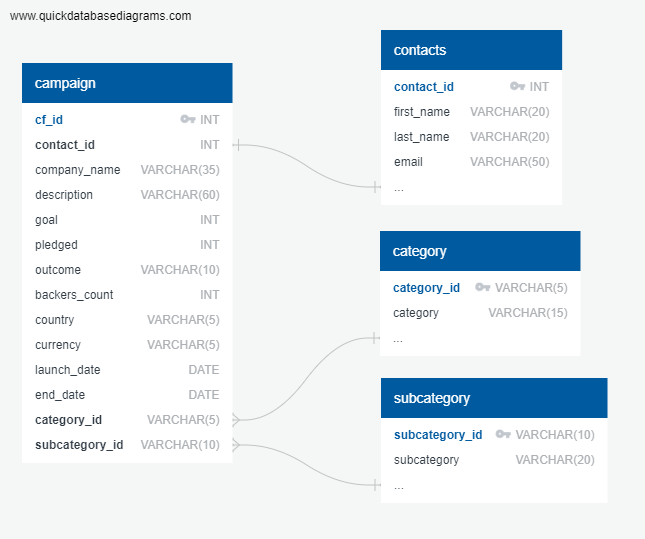

# Crowdfunding_ETL
Project #2: Extract, Transform, and Load

## Extracting and Transforming the Data
Python code to extrat and transform the data is provided in the file named 'ETL_Mini_Project_CChaney_LSayfan.ipynb'

## Database Schema

## Database Loading
SQL code to generate all 4 tables is provided in the file named 'Schema.sql'