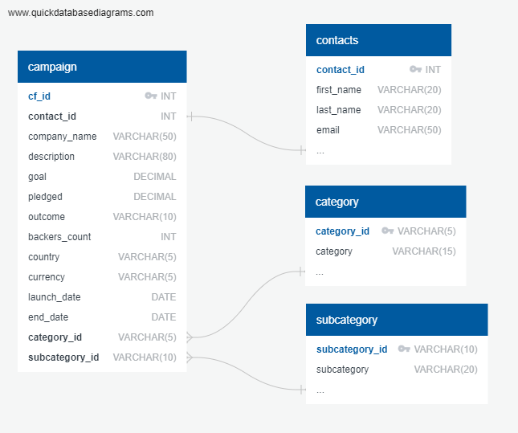

# Crowdfunding_ETL
Project #2: Extract, Transform, and Load

## Extracting and Transforming the Data
Python code to extract and transform the data is provided in the file named 'ETL_Mini_Project_CChaney_LSayfan.ipynb'

## Database Schema

## Database Loading
SQL code to generate all 4 tables is provided in the file named 'crowdfunding_db_schema.sql'

*Here are the screen shots to show that each table was created, and then loaded correctly*

#### After creating the contacts table:

#### After Importing the Data into the contact table:

#### After creating the category table:

#### After Importing the Data into the category table:

#### After creating the category subtable:

#### After Importing the Data into the subcategory table:

#### After creating the campaign table:

#### After Importing the Data into the campaign table:
